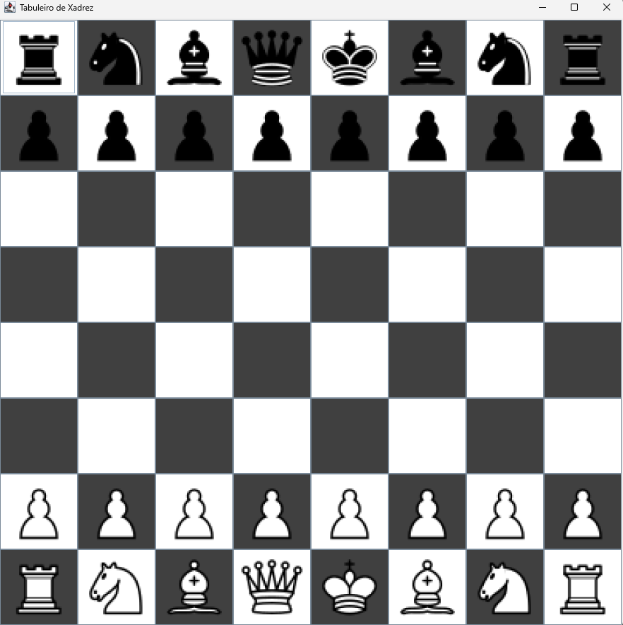
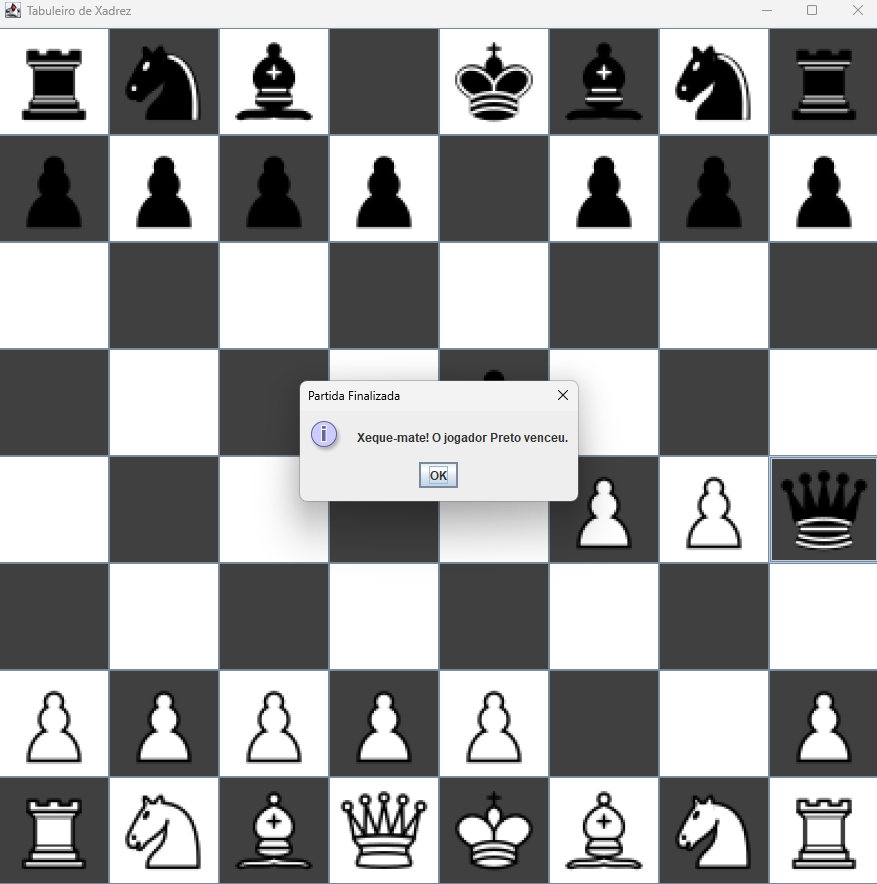

# Projeto Final - Jogo de Xadrez em Java - MATA55

Este repositório reúne o projeto final **"Jogo de Xadrez em Java"**, desenvolvido pelos alunos **Arthur Santos Correia** e **Matheus Dias Queiroz**, como parte da disciplina **MATA55 - Programação Orientada a Objetos**, oferecida no semestre **2025.1** pela **Universidade Federal da Bahia (UFBA)**.

## ♟️ Sobre o projeto:

Este projeto consiste em um jogo de xadrez, implementado em Java com o uso de interfaces gráficas via `Swing`. O jogo permite uma partida entre dois jogadores locais, respeitando as regras oficiais do xadrez tradicional:

- Movimento completo de todas as peças (rei, dama, torre, bispo, cavalo e peão);
- Regras especiais implementadas, como:
  - Roque;
  - En passant;
- Interface gráfica intuitiva com visualização do tabuleiro e peças;

- Verificação de xeque e xeque-mate;
  - Finalização da partida em caso de xeque-mate;

## 📚 Sobre a disciplina:

MATA55 é uma disciplina do Instituto de Computação da UFBA que aborda os fundamentos e princípios da **Programação Orientada a Objetos (POO)**, com foco em:

- Encapsulamento  
- Herança  
- Polimorfismo  
- Abstração  
- Tratamento de exceções  
- Coleções e estruturas de dados  
- Boas práticas de desenvolvimento orientado a objetos
